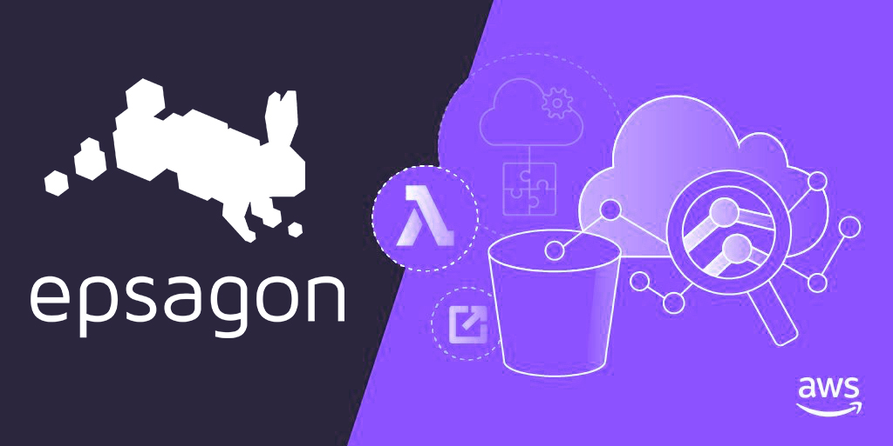
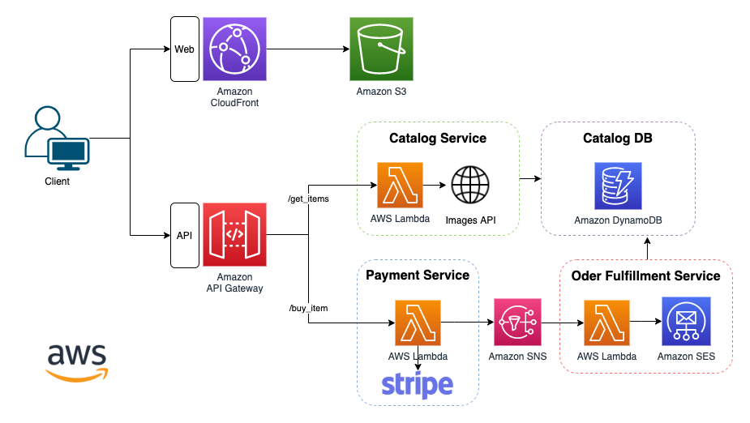

# AWS modernization with Epsagon

Welcome to the AWS Serverless with Epsagon workshop! In this workshop, you’ll learn how to gain observability into your serverless application using a built retail store. You’ll learn the key concepts of monitoring and troubleshooting applications using Epsagon. Have fun!

